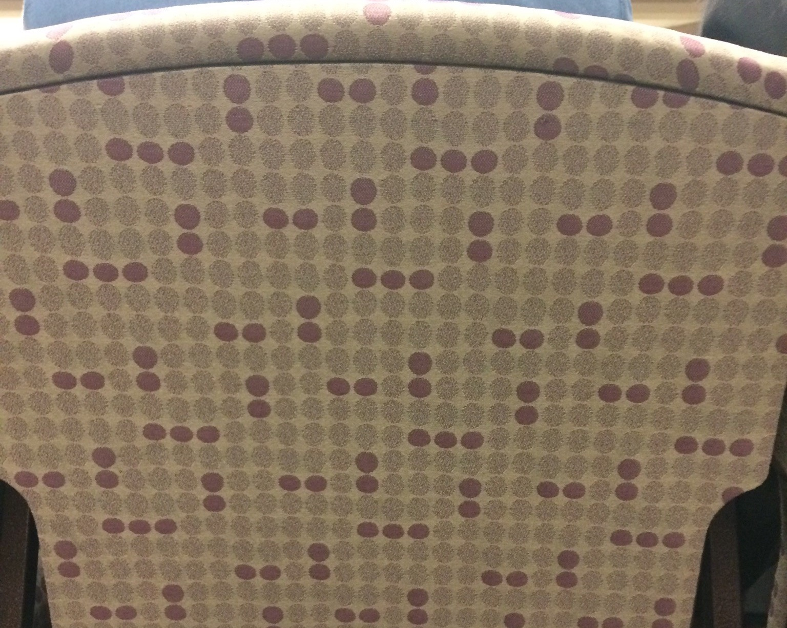

# Conway's Game of Life
## Applied to a fabric pattern

I saw a pattern on a chair that looked random. However, making a random pattern on a fabric is not practical, so I set out to find the pattern in the fabric. These are the results of staring at the pattern for very long.

My goal in determining the pattern was to run it through Conway’s Game of Life. 

### Pattern

The X stands for a purple spot on the fabric. The shaded area is the tile that should be tessellated.

Each cell that is part of the tile is given an id.

From the cell id grid it is useful to create a reverse index, i.e. from cell id to array index (coordinate).

|Cell ID |coordinate|
|---|---|
|0|n/a|
|1|(r1, c1) = (1, 9)|
|2|(r2, c2) = (1, 10)|
|...|...|
|# of cells|(r100,c100)|

To simulate how the pattern will evolve in Conway’s game the tile must be tessellated to infinity. Since that is not possible, I only calculate the evolution of a single tile. Since the next generation of the tile depends on the tiles immediately around the original, I have to include the border around the tile when finding the next generation. 

Finding the cell id that corresponds to each of the border cells around the tile only needs to be done once. First, the rules for shifting the tile must be provided. Then the coordinates where each cell id appears in the border is stored. Each time a new generation is calculated each border cell is filled with the value of the cell id that it corresponds to within the tile. Finally, the rules of life can be applied.

#### Improvement

Since there are 100=10*10 cells in the pattern I thought it might be possible to tile with a square. Based on the evolution of the pattern I noticed that there was a very rectangular pattern showing up. So I modified the tile boundaries above and made a square. Using a square is more convenient because it is easier to determine the translation rules. 
